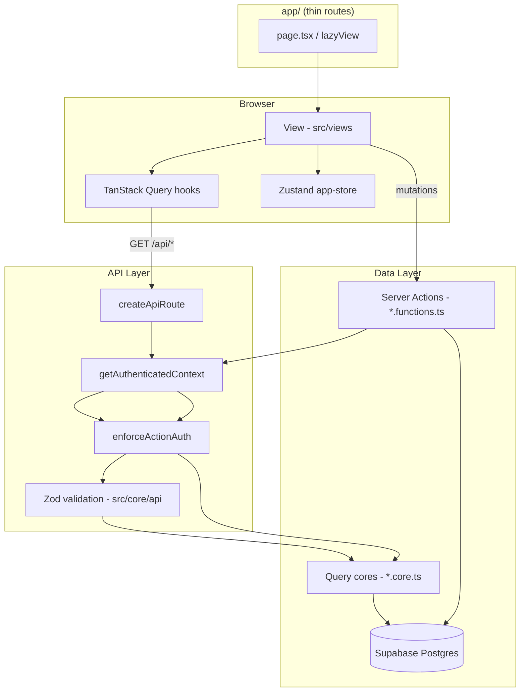

# Enterprise Architecture Report

**Date:** 2026-06-27  
**Platform:** FEC Operations Platform (FEC-OS)  
**Stack:** Next.js 15 · React 19 · Supabase · TanStack Query 5  
**Constraints honored:** No UI redesign · No business logic changes · No app rewrite · No migration deletions

---

## 1. Architecture audit summary

Full findings: **[ARCHITECTURE_AUDIT.md](./ARCHITECTURE_AUDIT.md)**

| Area | Finding | Severity |
|------|---------|----------|
| Layer violations | Minor (`lazy-view` in lib); no lib→views cycles | Low |
| Duplicate logic | `periodBounds` in 3 files; compliance derive split | Medium |
| Feature coupling | Dashboard secondary batches compliance + charts | Acceptable |
| Circular deps | None critical | Low |
| Client components | 100% of views are client | Medium |
| Large pages | 10 views >450 lines (max 709) | Medium |
| API validation | Was 0/86; now 3/86 high-traffic routes | High → in progress |
| Caching | Route cache + TanStack Query present | OK |
| Error boundaries | Root + global added | Improved |
| Logging | Standardized logger introduced | In progress |
| Tests | None | High debt |

Prior cleanup ([CLEANUP_REPORT.md](./CLEANUP_REPORT.md)): 28 files and 26 npm packages removed — **not repeated**.

---

## 2. Architecture diagram



---

## 3. Folder structure

### Current (2026-06-27)

```
app/
  (protected)/          # 85 pages — thin re-exports + 14 lazyView
  api/                  # 86 route handlers
src/
  core/                 # NEW — api/validation, logger
  features/
    compliance/         # NEW — pilot re-export barrel
  views/                # 80 client page components
  components/           # layout, feature, ui
  hooks/queries/        # 42 TanStack hooks
  lib/
    queries/*.core.ts   # 25 query cores
    server/             # auth, api-route, route-cache
    compliance/         # domain helpers
    *.functions.ts      # 38 server actions
  integrations/supabase/
docs/
  ARCHITECTURE.md
  ARCHITECTURE_AUDIT.md
  API.md                # NEW
  DATABASE.md
  ENTERPRISE_ARCHITECTURE_REPORT.md
  CLEANUP_REPORT.md
```

### Recommended migration path

| Phase | Action | Risk |
|-------|--------|------|
| **Done** | `src/core/api`, `src/core/logger` | Low |
| **Done** | `src/features/compliance` barrel | Low |
| **Next** | Move `src/lib/server/*` → `src/core/{auth,cache}` | Medium — update ~90 imports |
| **Next** | Zod on `/api/dashboard/charts`, `/api/daily-ops/*`, E3 routes | Low |
| **Later** | `src/shared/components` ← move `src/components/ui` | Medium |
| **Later** | Physical move compliance views/hooks → `src/features/compliance/` | High — do module-by-module |
| **Later** | Extract services only where route+action logic duplicates | Low per site |

**Do not big-bang** move all 80 views. One feature module per sprint.

---

## 4. Files moved/removed

### Added

| File | Purpose |
|------|---------|
| `src/core/api/validation.ts` | Shared Zod schemas + `ApiValidationError` |
| `src/core/logger/index.ts` | Structured server logging |
| `src/features/compliance/index.ts` | Pilot feature barrel |
| `app/global-error.tsx` | Root layout error boundary |
| `docs/ARCHITECTURE_AUDIT.md` | Full audit |
| `docs/API.md` | API reference |
| `docs/ENTERPRISE_ARCHITECTURE_REPORT.md` | This report |

### Modified

| File | Change |
|------|--------|
| `src/lib/server/api-route.ts` | 400 for validation errors; `@/core/logger` |
| `app/api/dashboard/kpis/route.ts` | Zod query validation |
| `app/api/dashboard/secondary/route.ts` | Zod query validation |
| `app/api/compliance/kpis/route.ts` | Zod query validation |
| `src/lib/queries/e3-compliance-tracker.core.ts` | E3 perf logging via `@/core/logger` |
| `docs/ARCHITECTURE.md` | Updated flow, paths, doc links |
| `docs/DATABASE.md` | Cross-links |

### Refactored

| File | Change |
|------|--------|
| `src/lib/queries/e3-compliance-tracker.core.ts` | `logE3TrackerPerf` → `@/core/logger` |

**No files moved** between directories (pilot uses re-exports only).  
**No DB migrations deleted.**

---

## 5. Dead code removed

### Removed / refactored

| Item | Location | Change |
|------|----------|--------|
| `logE3TrackerPerf` raw `console.log` | `e3-compliance-tracker.core.ts` | Refactored to `@/core/logger` (8 E3 API routes unchanged) |

Conservative — prior session already removed 28 files ([CLEANUP_REPORT.md](./CLEANUP_REPORT.md)).

---

## 6. Dependencies removed

**None in this session.** No `package.json` changes.

---

## 7. Bundle size improvements

**No measurable bundle change expected** — changes are server-side validation, logging, and docs.

Baseline (from CLEANUP_REPORT):

| Metric | Value |
|--------|-------|
| Shared First Load JS | 103 kB |
| Middleware | 90.4 kB |
| Heaviest route | E3 category ~426 kB |

`app/global-error.tsx` adds a minimal client chunk for catastrophic errors only.

---

## 8. Performance improvements

| Change | Impact |
|--------|--------|
| Zod validation on 3 KPI routes | Negligible CPU; rejects bad params early (400 vs 500) |
| Removed dead `console.log` in E3 perf helper | Standardized via logger |
| `global-error.tsx` | Faster recovery from root layout failures |

**Documented, not implemented** (from audit):

- Lazy-load `xlsx` / `jspdf` on export actions
- Self-host Google Fonts (Sora, Manrope)
- Extract subcomponents from 600+ line views to improve HMR

---

## 9. Remaining technical debt

| ID | Item | Priority |
|----|------|----------|
| TD-1 | Zod on remaining 83 API routes | P0 |
| TD-2 | Zero automated tests | P0 |
| TD-3 | `periodBounds` duplicated 3× | P1 |
| TD-4 | 100% client views — no RSC islands | P2 |
| TD-5 | 10 views >450 lines | P2 |
| TD-6 | `withAuthRouteRequest` vs `createApiRoute` naming drift | P3 |
| TD-7 | Process-local route cache — not multi-instance safe | P3 |
| TD-8 | No structured audit/security logging | P2 |
| TD-9 | Feature folder migration (6 modules) | P2 |
| TD-10 | Route-level `error.tsx` under `(protected)` | P3 |

---

## 10. Future recommendations

1. **Testing:** Add Vitest; test `src/core/api/validation.ts` schemas and top 5 query cores with mocked Supabase.
2. **API validation sprint:** Roll Zod schemas per domain (`daily-ops`, `e3-tracker`, `revenue`) using shared helpers.
3. **Compliance pilot completion:** Move `src/views/compliance-*`, `src/components/compliance*`, and compliance hooks under `src/features/compliance/` with path aliases; one PR.
4. **Services layer:** Introduce `src/features/*/services/` only when the same business rule appears in both an API route and a Server Action.
5. **Observability:** Wire `@/core/logger` into query core RPC fallbacks; add optional audit log table for admin mutations.
6. **Performance:** Dynamic `import()` for xlsx/jspdf in export handlers on `/reports` and E3 register pages.
7. **Horizontal scaling:** Replace in-memory `route-cache` with Redis or Next.js `unstable_cache` when running multiple instances.

---

## Validation results

```
npm run lint         → exit 0 (1 pre-existing warning: custom fonts in app/layout.tsx)
npx tsc --noEmit     → exit 0
npm run build        → exit 0 (~163 routes, First Load JS 103 kB)
```

---

## Report index

| Document | Path |
|----------|------|
| Architecture audit | `docs/ARCHITECTURE_AUDIT.md` |
| Architecture overview | `docs/ARCHITECTURE.md` |
| API reference | `docs/API.md` |
| Database | `docs/DATABASE.md` |
| Prior cleanup | `docs/CLEANUP_REPORT.md` |
| This report | `docs/ENTERPRISE_ARCHITECTURE_REPORT.md` |

---

*Enterprise architecture review — 2026-06-27*
